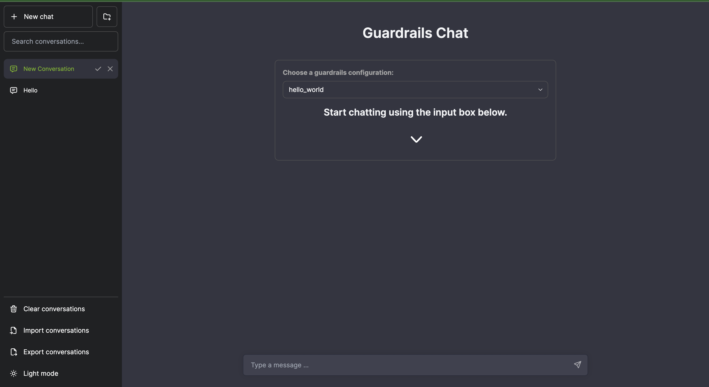

# Deploying NeMo Guardrails on Azure Kubernetes Service (AKS)

This guide walks you through deploying NeMo Guardrails on AKS using a GPU-enabled node pool.

## Prerequisites

- Azure CLI installed
- Access to an Azure account with permission to create AKS clusters
- Docker installed (for building the Docker image)
- Helm installed

## Steps

### 1. Clone NeMo Guardrails Repository

Clone the official NeMo Guardrails repository to get access to the source code:

```bash
git clone https://github.com/NVIDIA/NeMo-Guardrails
cd NeMo-Guardrails
```

### 2. Build the Docker Image

Follow the instructions provided by NVIDIA to build a Docker image for NeMo Guardrails:

[Building a Docker Image](https://docs.nvidia.com/nemo/guardrails/user_guides/advanced/using-docker.html)

### 3. Create an AKS Cluster

Create an AKS cluster. Replace `<resource group name>` and `<aks cluster name>` with your desired values.

```bash
az aks create --resource-group <resource group name> --name <aks cluster name>
```

**Example:**

```bash
az aks create --resource-group vikalluru-nim-demo --name nim-demo
```

### 4. Add a GPU Node Pool

Add a GPU-enabled node pool to your AKS cluster. Replace placeholders with your desired values. You need only 1 CPU instance to deploy nemoguardrails. However, in this example we used one NC series A100 instance instead.

```bash
az aks nodepool add --resource-group <resource group name> --cluster-name <aks cluster name> --name <nodepool name> --node-count 1 --skip-gpu-driver-install --node-vm-size <desired VM type> --node-osdisk-size 2048 --max-pods 110
```

**Example:**

```bash
az aks nodepool add --resource-group vikalluru-nim-demo --cluster-name nim-demo --name gpupool --node-count 1 --skip-gpu-driver-install --node-vm-size Standard_NC24ads_A100_v4 --node-osdisk-size 2048 --max-pods 110
```

### 5. Connect to AKS Cluster

Get the cluster credentials to connect your local `kubectl` to the AKS cluster.

```bash
az aks get-credentials --resource-group <resource group name> --name <aks cluster name>
```

### 6. Install the NVIDIA GPU Operator

Install the NVIDIA GPU Operator to manage GPU resources within the AKS cluster.

```bash
helm repo add nvidia https://helm.ngc.nvidia.com/nvidia --pass-credentials
helm repo update
helm install --create-namespace --namespace gpu-operator nvidia/gpu-operator --wait --generate-name
```

### 7. Create Namespace for NeMo Guardrails

Create a dedicated namespace for the NeMo Guardrails deployment.

```bash
kubectl create namespace guardrails
```

### 8. Deploy NeMo Guardrails with Helm

Clone the repository containing the Helm chart for NeMo Guardrails and install it:

```bash
git clone https://github.com/vikalluru/nemoguardrails-k8s.git
cd nemoguardrails-k8s
helm --namespace guardrails install nemo-guardrails nemoguardrails
```

### 9. Configure Guardrails Using ConfigMap

Use a ConfigMap to provide the configuration files to NeMo Guardrails.

```bash
kubectl create configmap config-folder --from-file=/home/azureuser/nemoguardrails/examples/configs -n guardrails
```

### 10. Verify NeMo Guardrails Deployment

Check the logs to ensure the NeMo Guardrails server is running correctly.

```bash
kubectl describe pod <pod-name> -n guardrails
```

Replace `<pod-name>` with the name of the running pod, which you can get by running:

```bash
kubectl get pods -n guardrails
```

### 11. Access the Guardrails Chat UI

Retrieve the external IP address of the NeMo Guardrails service.

```bash
kubectl get all -n guardrails
```

You should see output similar to:

```plaintext
NAME                                                 READY   STATUS    RESTARTS   AGE
pod/nemoguardrails-nemoguardrails-66969bfc48-h5zsg   1/1     Running   0          33m

NAME                                    TYPE           CLUSTER-IP    EXTERNAL-IP      PORT(S)          AGE
service/nemoguardrails-nemoguardrails   LoadBalancer   10.0.164.27   108.142.102.89   8000:31013/TCP   33m
```

Ping the Guardrails Chat UI by navigating to the external IP and port (e.g., `http://108.142.102.89:8000`). You should see a UI similar to the screenshot below:


